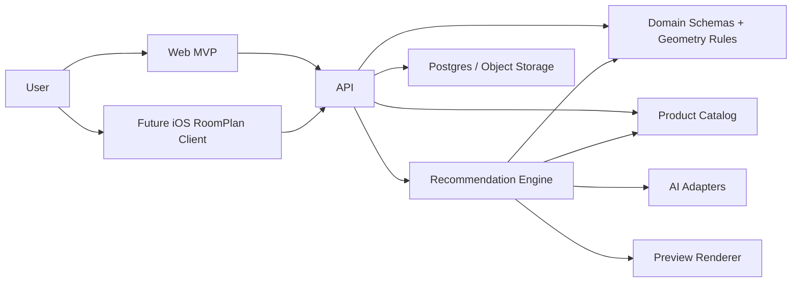

# Architecture

## Product Principle

Every recommendation should pass three tests:

1. It fits the room geometry.
2. It maps to real catalog products.
3. It explains why it matches the user's style and budget.

Pretty renders are useful, but they are downstream of those checks.

## System Map

## Current Repo Boundaries

| Area | Package/App | Responsibility |
| --- | --- | --- |
| Domain model | `packages/domain` | Room, product, placement, and design-card schemas; geometry and fit rules. |
| Catalog | `packages/catalog` | Seed products, search filters, future feed-normalization boundary. |
| Recommendation | `packages/recommendation` | Design concepts, product retrieval, layout placement, validation, scoring. |
| API | `apps/api` | HTTP boundary for catalog and design-card generation. |
| Web prototype | `apps/web` | MVP interface for room inputs, cards, floor plan preview, and warnings. |
| Native capture | `apps/ios` | Placeholder for RoomPlan client once the core loop is validated. |

## Data Flow

1. User creates a room with confirmed dimensions.
2. API validates room JSON with shared schemas.
3. Recommendation package creates style concepts.
4. Catalog search retrieves real products with dimensions.
5. Layout logic places products into the room.
6. Geometry rules reject or penalize bad layouts.
7. API returns design cards, product references, scores, and warnings.
8. Web app renders cards and a 2D floor plan.
9. User edits the 2D layout; the API revalidates the edited placements.
10. Later, AI adapters add photo analysis and rendered previews without bypassing validation.

## Core Data Objects

- `Room`: dimensions, room type, windows, doors, obstructions, and existing furniture.
- `CatalogProduct`: verified product data with dimensions, price, URL, tags, and confidence scores.
- `DesignCard`: a complete concept with selected products, positions, scores, warnings, palette, and explanation.
- `productAlternatives`: item-level product IDs that can replace a selected product without letting AI invent shopping data.
- `LayoutWarning`: machine-readable issue for collisions, door blockage, low dimension confidence, budget miss, or missing essentials.

## AI Boundary

AI should produce structured suggestions that are validated before use.

Allowed AI output:

- room style brief
- visible-item summary
- design concept names
- palette ideas
- explanation copy
- product style tags
- rendered preview prompts

Rejected AI output:

- invented purchase URLs
- invented prices
- unverified dimensions
- unsupported availability claims
- layout placements that bypass collision checks

## MVP Deployment Shape

For the first hosted version:

- Vercel/Netlify for the web app
- Render/Fly/AWS for the API
- Postgres for persisted rooms, designs, and products
- S3-compatible object storage for room photos and preview renders
- Redis or queue service for slow AI/render jobs

The current code uses seed data so the architecture can run locally before adding infrastructure.

## Future RoomPlan Integration

RoomPlan should enter as a capture adapter that exports or maps scan output into the same `Room` JSON used by the web MVP. The API should not care whether a room came from manual entry, RoomPlan, ARCore, or an uploaded floor plan as long as the normalized room schema is valid.

## Privacy Notes

Room photos and scans can expose homes, possessions, addresses, and habits. Production design should include:

- explicit upload consent
- object-storage encryption
- user-initiated delete
- short retention for raw photos
- separate derived room geometry when possible
- audit trail for external AI processing
